INITIATION DOCKER , GIT GITHUB
-Lors de l'installation j'ai rencontrer u probleme que j'ai reussit a resoudre en telechargeant wsl avec la commande "wsl --install"
-TP 1, lancer mon premier conteneur

1. Exécuter docker run hello-world.
   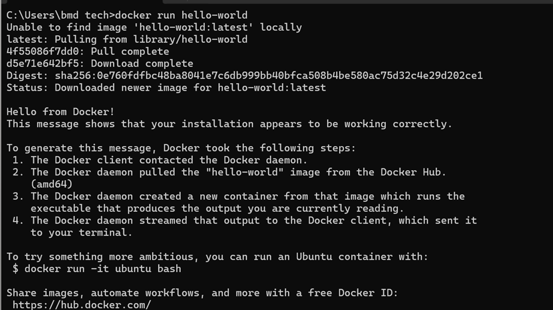

Lister les conteneurs avec docker ps-a.
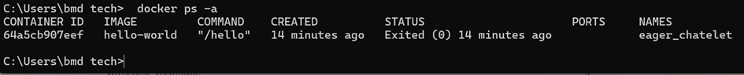
//voir capture

-TP 2, lancer un serveur web et l'a cher
1.Lancer un serveur nginx relié au port 8080
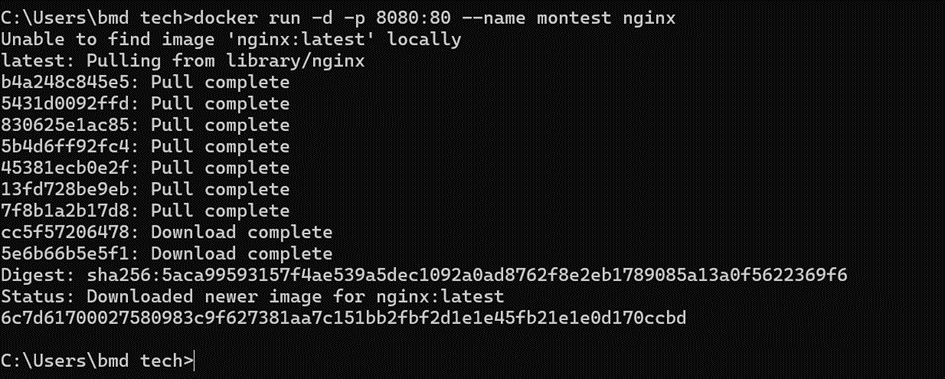
Le lancement fonctionne a merveille

2.Ouvrir http://localhost:8080 dans mon navigateur
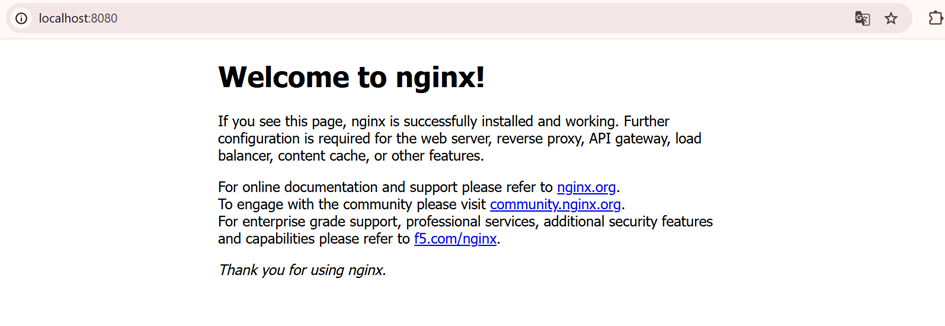
tout marche comme il le faut.

3.Regarder les logs
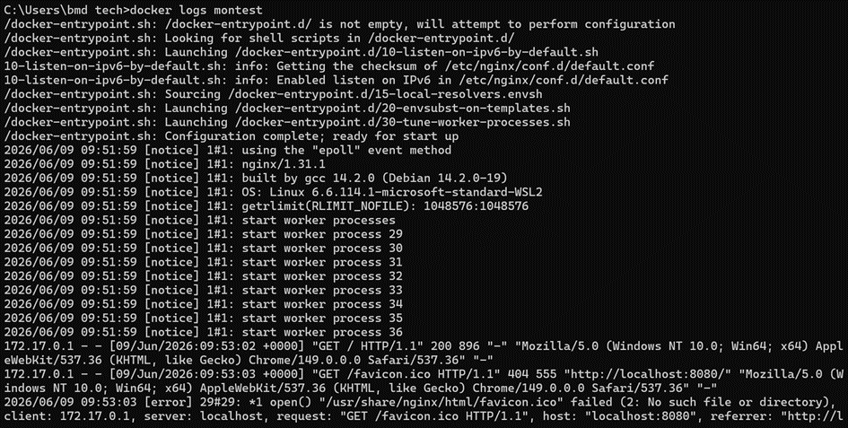
voir capture

4-Arrêter puis supprimer
 //arreter
 //supprimer

-TP 3, entrer dans un conteneur

1. Relancer un conteneur
   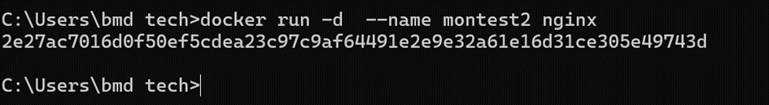
   2.Entrer dedans
   
   3.Explorer le conteneur
   
   4.Sortir avec exit ,puis nettoyer
   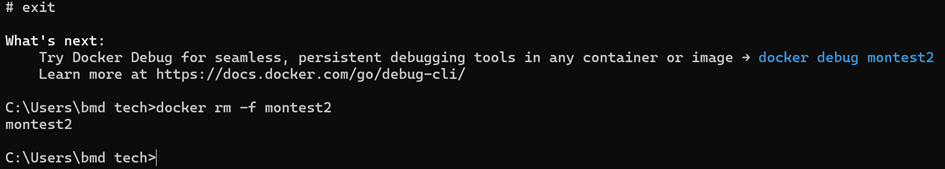
   TP 4, créer ma propre image avec un Dockerfile
   Construire l'image
   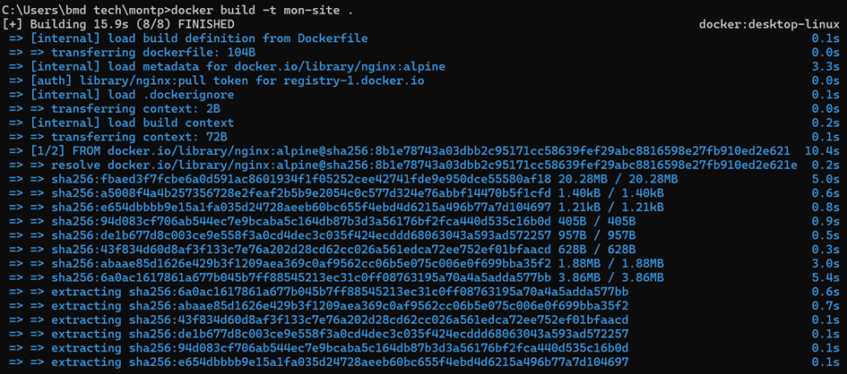
   Lancer l’image
   
   Ouvrir localhost :8080
   
   Nettoyer
   
   TP 5, utiliser docker compose
   Démarrer le compose
   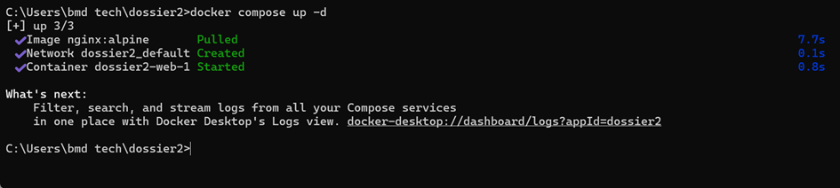
   Vérifier sur http://localhost:8080.
   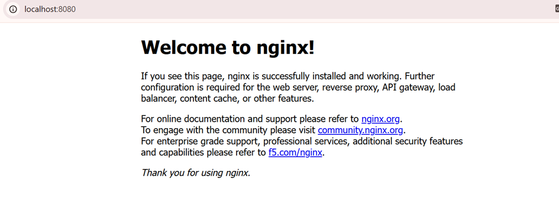
   Arrêter tout avec docker compose down.
   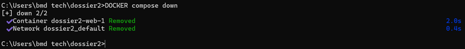
